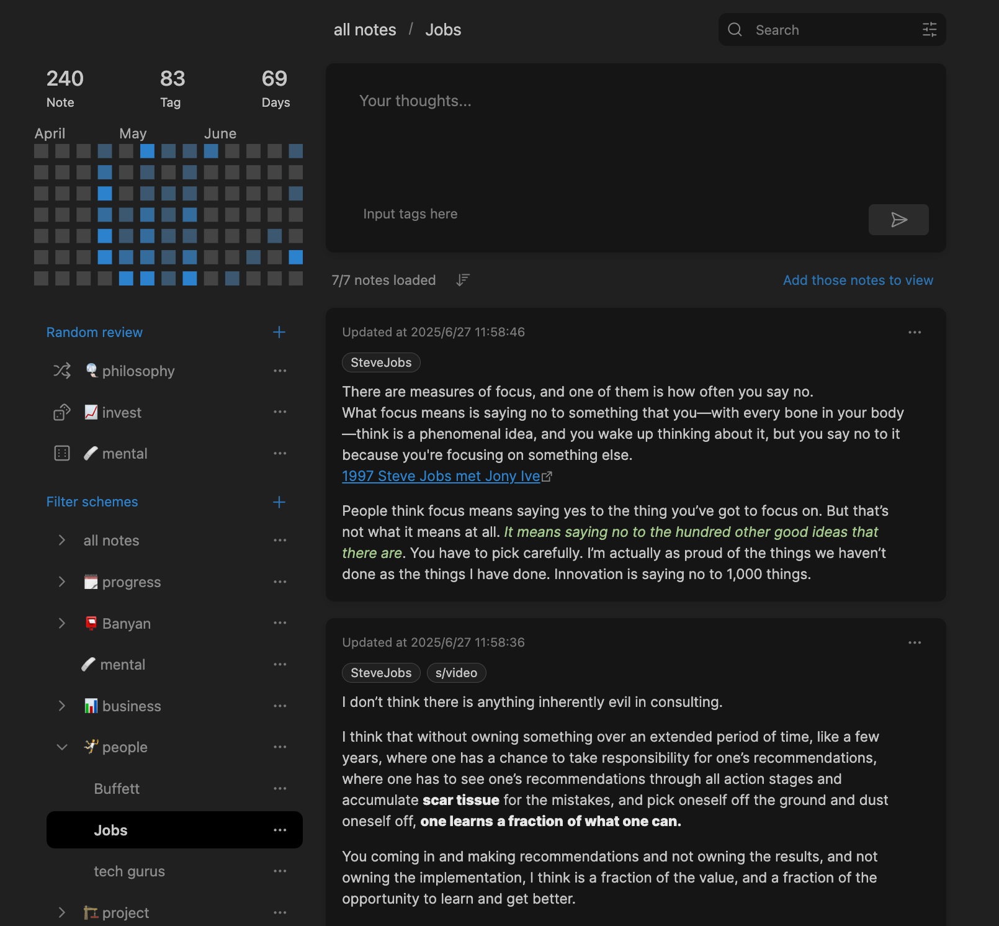

# Banyan - Your Obsidian Homepage

English | [简体中文](./docs/README_zh.md)

## What does this plugin do?

Banyan helps you better organize, browse, and review your notes. For example, when you want to find notes on a specific topic, see what you've written recently, or randomly browse through old notes.

When creating notes, you only need to record content and add tags, without worrying about coming up with the perfect title or organizing them into complex folder structures.  
Access your past notes easily through the powerful filtering card view panel.  
This is especially useful for users who prefer to write short notes.  
Create custom random reviews to rediscover forgotten notes.

## Main Features

### 🃏 Card View - See All Your Notes at a Glance
- Turns your notes into cards with clear titles, content previews, and tags
- Supports single or double column display based on your screen size
- Right-click cards for quick actions like open, delete, pin, etc.

### 🏷️ Compound Filtering - Find Exactly What You Need
- Filter by tags: Supports multi-tag filtering, such as notes with `study AND important`, notes with `music OR movie`
- Filter by time: View notes from a specific time period
- Search content: Search for keywords in note content

### 💾 Save Filter Conditions - Set Once, Use Again
- Save commonly used filter conditions for quick access
- Examples: "work notes", "study materials", "todo items", etc.

### 🎲 Random Review - Rediscover Old Notes
- Randomly open notes to rediscover forgotten good content
- Can limit scope, such as only notes with the `reading` tag
You can even use random browsing to meet your past selves from different periods again

### 📊 Heat Map Statistics - Understand Your Writing Habits
- Shows when you write the most notes using a heat map
- Helps you understand your writing patterns

## How to Use

### Note Panel - Browse Card Notes
- Click the icon in the left sidebar, or use `Ctrl/Cmd + P` command to open the note panel

### Add New Notes
- In the desktop panel, you can create notes via the editor area.
- Click the bulb icon in the left sidebar, or use the `Ctrl/Cmd + P` command to open a new note.
- Notes work just like regular Obsidian notes, but there are 2 additional properties:
    - The `tags` field, where you can input tags, or you can add tags in the note body - they will all appear in the tag line of the card view.
    - The `id` field - please don't modify this, it's required for the plugin to function properly.

### Random Review
- You can add or modify random review items in the sidebar of the panel view, and the left sidebar will also display corresponding new icons
- Click on random review items, or the random review icon in the left sidebar, to open notes in the plugin directory that meet the tag filtering conditions.

### Plugin Settings

- Note directory: Defaults to `cards` to avoid conflicts with existing folders.
- Open panel on startup: Automatically open the card panel when Obsidian starts.
- Number of columns: On desktop, choose single or double column.
- Show title or not
- Card content max height: Short / Normal / Expand.
- Show backlinks: Display notes that reference the current note at the bottom of the card.
- Double click to edit (Desktop): Double-click a card to switch to edit view directly.

## Installation

### Method 1: Install from Obsidian Community (Recommended)
1. Open Obsidian settings
2. Find "Third-party plugins"
3. Turn off "Safe mode"
4. Click "Browse", search for "Banyan"
5. Install and enable

### Method 2: Manual Installation
1. Download the package from the releases page
2. Extract to `.obsidian/plugins/` directory
3. Enable the plugin in Obsidian settings

## Questions?

Feel free to ask questions or make suggestions on GitHub!

Or join this project's Discord: https://discord.gg/HGCmK8YzaX

## License

GPLv3 - See [LICENSE](LICENSE) file for details